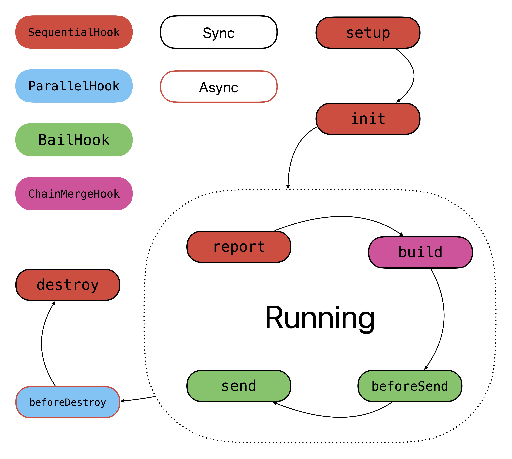

<h1 align="center">Tracker</h1>

Tracker 是一个用于处理前端埋点的 SDK，它拥有丰富的 Hooks 来保证其灵活性，可以让您根据自己具体需求，编写或组装插件，以实现您各种复杂需求

## 使用

Tracker 追求`高灵活`和`易使用`，所以提供必要的 Hooks 以 Plugin 形式来保证灵活性，这部分充分参考了 [Rollup](https://github.com/rollup/rollup/blob/master/src/utils/PluginDriver.ts) 设计思想，并且会提供一个拥有全部功能的默认包，来保证易用性

### 使用全部能力

```sh

pnpm install @tracker/browser-tracker

```

引入到项目中后

```typescript
import { createBrowserTracker } from "@tracker/browser-tracker";

export const tracker = createBrowserTracker({
  url: "/apis/success",
  xhrResponseType: "json",
  xhrTimeout: 1000,
  plugins: [] // 加载更多定制功能
});
```

虽然拥有全部功能，但是也提供了灵活的配置来开关功能，但是更加建议根据自己的需求按需组装功能，这样包更小

### 定制功能

Tracker 核心原理是 Core + Plugin，Core 是一个处理各种 Hooks 的执行器，Plugin 为使用 Hook 来实现一个最小完备的功能

因此定制功能应为 Core 加您需要的 Plugin，如下：

```sh

pnpm install @tracker/core @tracker/web-click

```

随后

```typescript
import { TrackerCore } from "@tracker/core";
import { webClick } from "@tracker/web-click";

const collect = new TrackerCore({
  plugins: [webClick()] //其他插件...
});

collect.init(); // tracker 已启动
```

## 编写一个 Plugin

插件系统，充分参考（chaoxi） Rollup，主要有以下 Hooks：

```typescript
export interface FunctionPlugins {
  // 启动时
  setup: (this: PluginContext, initConfig: TrackerCoreConfig) => void;
  // 初始化完成
  init: (this: PluginContext, ctx: TrackerCore) => void;
  // 触发一个数据报告
  report: (this: PluginContext, event: string, record: Record<string, any>) => void;
  // 组装合并需要发送的数据
  build: (this: PluginContext, event: string, record: Record<string, any>) => Record<string, any>;
  // 发送数据前，主要用于阻止发送
  beforeSend: (this: PluginContext, event: string, build: Record<string, any>) => boolean | void | null;
  // 发送具体实现
  send: (this: PluginContext, event: string, build: Record<string, any>) => boolean | void | null;
  // 销毁 tracker 实例前操作
  beforeDestroy: (this: PluginContext, ctx: TrackerCore) => any;
  // 销毁 tracker 实例具体操作
  destroy: (this: PluginContext, ctx: TrackerCore) => void;
}
```

这里有一个图解，能够更加便捷您理解流程



### Plugin Hooks 的上下文

每一个 Hook 都有一个 PluginContext 里面提供了便捷的方法

> Hooks 不要使用 [剪头函数](https://developer.mozilla.org/zh-CN/docs/Web/JavaScript/Reference/Functions/Arrow_functions) 因为 Hooks 上下文通过 this 来运行

```typescript
interface PluginContext {
  logger: Logger;
  meta: ContextMeta;
}

interface ContextMeta {
  version: string;
}

interface Logger {
  warn: (...args: any[]) => void;
  info: (...args: any[]) => void;
  error: (...args: any[]) => void;
  throwError: (base: Error | string) => never;
}
```

### Plugin Hooks 的执行顺序

每一个 Plugin Hooks 都可以写成对象形式，同时提供一个 order 属性，来决定它的执行优先级

```ts
import type { TrackerPlugin } from "@tracker/core";

export function myPlugin(): TrackerPlugin {
  return {
    name: "myPlugin",
    setup: {
      order: "pre",
      handler(initConfig) {
        this.logger.info(initConfig);
      }
    }
  };
}
```

这个插件会在 setup 中提前执行，其他生命周期类似

### Plugin Hooks 的类型

Hooks 有很多执行方式，最常见的就是单纯的调用，像 Vue 的生命周期，大多是仅仅执行调用

在这里 Hooks 如果按照执行类型，可划分为异步和同步

比如 `beforeDestroy` 就是一个异步的，因为销毁前经常回做一些异步操作，比如：发送一个销毁 report

其他 Hooks 出于性能考虑，不建议做异步操作，因此都是同步的

如果按照执行方式可分为：

1. 顺序执行 Hook 如 setup 、init、report、destroy，这些会按照 Hook 顺序，一个一个执行
2. 熔断执行 Hook 如 beforeSend、 send ，这些在遇到第一个返回 false 的就不会再执行后边的
3. 同步执行 Hook 如 beforeDestroy ，这个会同时执行，只有全部返回才会执行下一个 Hook
4. 顺序合并 Hook 如 build ，这个会把每一个 Hook 的返回值，合并到一起

总的来说就是每一个 Hook 执行方式的不同，决定了这个 Hook 需要做什么样的事情

比如

我需要监听所有的 fetch 请求，常见的方式就是重写一下 fetch 方法，这时候，我可以在 setup 这个 Hook 里面 重写 fetch，在 destroy 这个 Hook 重写回去，释放副作用

我需要在页面离开时，发送一个数据，但是 xhr 方式放在 onbeforeunload 中会存在上报丢失，需要使用 Beacon ，此时只需要写一个 send Hook 提供比较高的 order ，这样就会在默认 xhr 发送方式之前熔断，就会使用 Beacon Api 发动数据

### 基于 Event

Tracker 会拥有非常多的监听，每一个监听定义为一个事件，拥有一个 name ，这点在 report 这个 Hook 就有表示，每一个 Event 都应是独立的、收敛的、一致的

每一个 Event 都应该表示一个监听不能重复，是一个个独立个体

每一个 Event 都在被 Hook 处理的时候，应先判断 name ，不要影响到其他 Event ，不要影响到其他 Event，足够收敛

每一个 Event 在最终被发送出去的时候，数据维度，结构，应该保持一致

## 贡献插件

这里非常期待贡献您的想法，得益于 monorepo 方式管理仓库，这里提供了便捷的开发工作流

如果您想编写一个新的 Plugin 可以运行 `pnpm run bootstrap` 它会引导您快速创建一个插件模版

同时拥有一个基于 Vite 演练场，你只需要运行 `pnpm run dev` 和 `pnpm run playground` 就会打开开发模式，同时运行演练场项目，你在新建项目里面的任何修改都会迅速的作用到演两场项目中

如果您 Fork 此项目，自己使用，运行 `pnpm run release` 可以提供引导，便携的选择版本，随后发布至 npm

当您完成了您的 Plugin 开发，请保证 通过以下命令

```sh

pnpm run format

pnpm run eslint

pnpm run test:tsc

```

Tracker 使用了 husky 来强制校验，不然无法提交 commit

如果可以的话，请编写完善的单元测试，Tracker 使用 [jest](https://jestjs.io/) 来处理单元测试

同时可以在编写时运行 `pnpm run test:watch` 这样会根据您的编写来自动运行单元测试

## 打包产物

Tracker 参考了 Vue 打包提供了多种打包产物主要有以下

1. `cjs`

主要运行于 commonjs

2. `cjs.prod`

主要运行于 commonjs ，但是去除了 `__DEV__` 的 Tree Shaking 代码

3. `esm-browser`

主要使用 esm 运行于浏览器

4. `esm-browser.prod`

主要使用 esm 运行于浏览器，但是去除了 `__DEV__` 的 Tree Shaking 代码

5. `esm-bundler`

主要运行于基于 esm 打包工具使用，相对于 `esm-browser` 去除了 external 包

6. `global`

可以直接在浏览器运行的代码

7. `global.prod`

可以直接在浏览器运行的代码，但是去除了 `__DEV__` 的 Tree Shaking 代码

以上打包的不同产物可以根据不同标识来使用 Tree Shaking 来确定部分代码在不同环境是否存在

在 `global.d.ts`

```ts
declare const __DEV__: boolean; // 是否是 dev 环境 主要用于去除生产环境日志
declare const __VERSION__: string; // 当前版本号
declare const __NAME__: string; //当前主包名称，仅为 monorepo name
declare const __TEST__: boolean; // 是否是 test环境下运行
declare const __ESM_BUNDLER__: boolean; // 是否是 esm-bundler 环境下运行
declare const __ESM_BROWSER__: boolean; // 是否是 esm-browser 环境下运行
declare const __GLOBAL_BUILD__: boolean; // 是否是 global 环境下运行
```

## 缘起

起源于公司埋点体系的混乱，各种埋点需求，分别对接不同平台，频繁和复杂的对接苦不堪言，于是探索一条优雅的方案，在研究网上各种大量资料后，有此具体方案实践

## 最后

关于埋点，上报至服务器仅仅是第一步，后续还有关于上报数据的处理和分析结果，这点正是目前欠缺的
